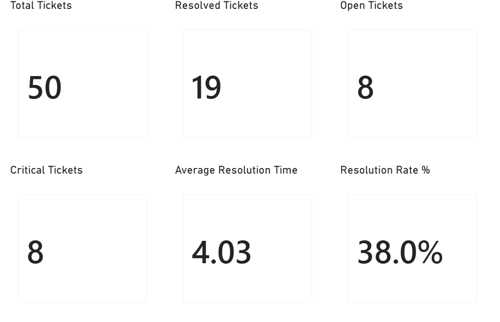
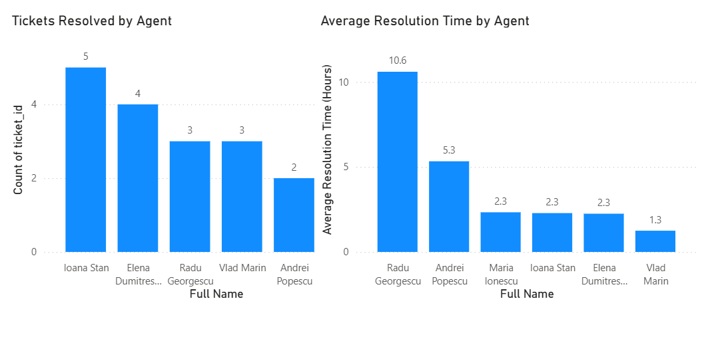
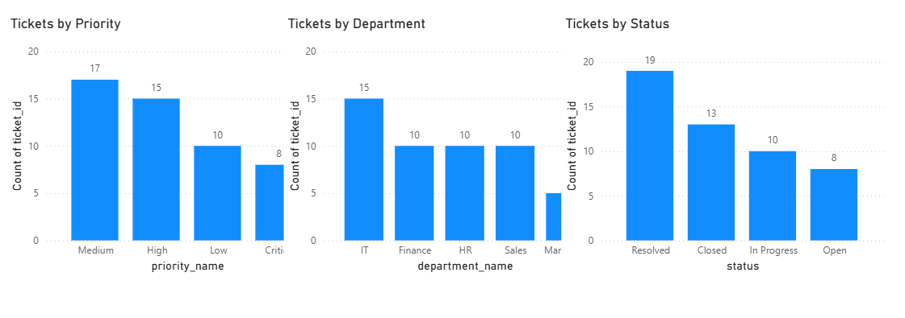

# Power BI Help Desk Dashboard

## Project Overview

This project is a Help Desk support analysis built using MySQL, SQL and Microsoft Power BI.

The project follows a complete data workflow:

**MySQL database → SQL analysis → Power BI dashboard**

The goal was to analyze support tickets, resolution performance, priorities, departments and ticket status through an interactive Power BI report.

## Project Goals

* Analyze Help Desk ticket data
* Monitor key support KPIs
* Analyze ticket distribution by priority, department and status
* Compare agent performance
* Calculate average resolution time
* Calculate resolution rate
* Build a professional Power BI dashboard

## Tools and Technologies

* MySQL
* SQL
* Microsoft Power BI
* DAX
* GitHub

## Dashboard Structure

### 1. Support Overview

The main overview page contains six key performance indicators:

* Total Tickets
* Resolved Tickets
* Open Tickets
* Critical Tickets
* Average Resolution Time
* Resolution Rate

This page provides a quick overview of the overall Help Desk activity.

### 2. Agent Performance

This page focuses on support agent performance.

It contains:

* Tickets Resolved by Agent
* Average Resolution Time by Agent

The resolved ticket chart is ordered by the number of resolved tickets, allowing the highest-performing agents to be identified quickly.

### 3. Ticket Analysis

This page analyzes the distribution of support tickets.

It contains:

* Tickets by Priority
* Tickets by Department
* Tickets by Status

These visualizations help identify the distribution and current state of the support workload.

## Key Metrics

The dashboard includes the following main metrics:

* Total Tickets: 50
* Resolved Tickets: 19
* Open Tickets: 8
* Critical Tickets: 8
* Average Resolution Time: 4.03 hours
* Resolution Rate: 38%

## Data Model

The Power BI report uses the Help Desk database created in MySQL.

The database contains entities related to:

* Tickets
* Users
* Agents
* Departments
* Priorities
* Comments

Relationships between the tables were configured in Power BI to allow ticket data to be analyzed by agent, department, priority and other dimensions.

## SQL to Power BI Workflow

The project was developed as a complete workflow:

1. Created the Help Desk database in MySQL
2. Created and populated the database tables
3. Performed SQL analysis using queries
4. Connected the database to Power BI
5. Created relationships between the tables
6. Created DAX measures
7. Built KPI cards and charts
8. Designed the final dashboard
9. Exported screenshots for documentation

## Screenshots

### Support Overview

### Agent Performance

### Ticket Analysis

## Project Files

* `HelpDesk_Dashboard.pbix` - Power BI report
* `support-overview.png` - Support Overview dashboard screenshot
* `agent-performance.png` - Agent Performance dashboard screenshot
* `ticket-analysis.png` - Ticket Analysis dashboard screenshot
* `README.md` - Project documentation

## What I Learned

Through this project I practiced:

* Connecting MySQL databases to Power BI
* Working with relational data
* Creating relationships between tables
* Creating DAX measures
* Building KPI cards
* Creating interactive charts
* Analyzing support ticket data
* Designing a professional dashboard
* Presenting SQL analysis through Power BI

## Project Workflow

This project demonstrates a complete support analytics workflow:

**MySQL → SQL → Power BI → Dashboard**
